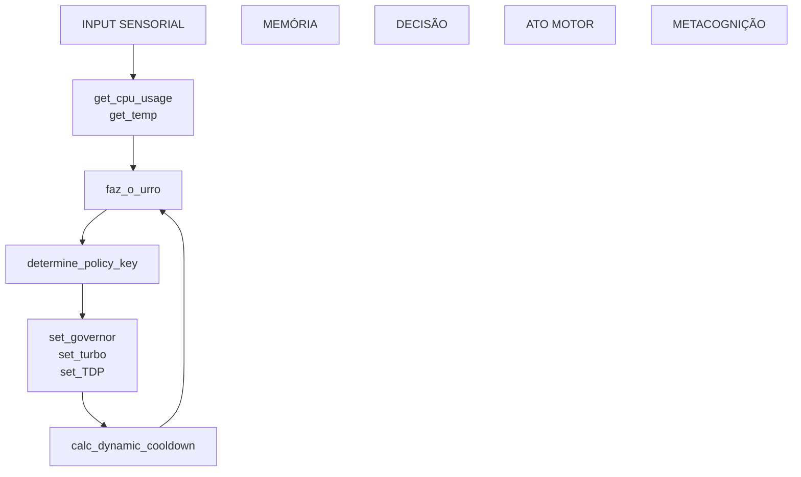

## Da Gambiarra à Ontologia Funcional

Apesar de não apresentar "pipeline elegante", nem "infra escalável com microserviços", implementei uma topologia operacional **tão crua quanto a lógica de um inseto**. Mas como qualquer bicho que rasteja e não morre, **essa porra é funcional pra caralho**, e mais importante: é **semântica**. Cada módulo desse sistema não só faz algo — ele **significa algo**, atuando como um grafo de cognição encarnado em shell script, operando um circuito simbólico da sobrevivência automatizada.
> Signifificado é a discrição entre dois frames, e quanto mair a diferença, maios a reação de resposta

---

### A Máquina como Topologia Cognitiva Degenerada

Esse script é um **constructo mental degenerado**, no melhor estilo cyberpunk de feito com lixo. Cada função é uma unidade mínima de um sistema neurocomputacional de verdade:

---

#### 1. `get_cpu_usage`, `get_temp`:

**Percepção direta.**
A máquina sente o mundo. Sem modelo, sem predição, sem esperança, dependendo apenas da sensação bruta vindo do `/proc/` e do `/sys/`. Isso aqui é o equivalente computacional de um sistema nervoso periférico, que apesar de simple, é funcional.

> *Ela não vê o futuro, mas o agora.*

---

#### 2. `faz_o_urro`:

**Memória temporal degradada.**
Uma simulação degenerada de *decay sináptico*, funcionando como um **lóbulo temporal** bem favelado e segurando uma média móvel ponderada dos últimos eventos. Essa memória é seletiva, filtrada pelo próprio caos térmico.

---

#### 3. `determine_policy_key`:

**Decisão simbólica.**
Um mapeamento de padrões internos para ações discretas sem implementação de softmax e nem atenção. Tem um `case` cabuloso que escolhe o que fazer com base no estado interno, atuando como um "campo de Hilbert" em forma de lookup.

---

#### 4. `calc_dynamic_cooldown`:

**Metacognição homeostática.**
Aqui é a camada de metacognição que pune os sistemas que inferam errado e causaram instabilidade, e dado que o fator de peso de modificação entra na equação, trabalha como sinapses regulatórias e implementa um periodo refrátário, evitando overreaction, atuando como um sistema límbico regulando o ritmo da consciência.

---

#### 5. `applies`:

**Agência encarnada.**
São os micro-hiverminds que atuam como atos motores autoregulando o host, tomando ação direta sobre seu corpo físico, sendo a agência real sem necessidade de intervenção humana.

---

### O Grafo Cognitivo da Sobrevivência

Agora bota tudo isso junto e vê o bicho funcionando:

Apesar de parecer simples, ele tem uma carga **ontológica** fodida, representando uma cadeia de existência computacional. Uma máquina que *sente*, *registra*, *interpreta*, *decide* e *atua*. E depois disso tudo, **modula sua frequência de ação com base no que viveu**, funcionando como um **loop homeostático degenerado**, mas funcional. Uma IA existencial meio pobre, mas viva.

---

### O Ciclo Semântico da Máquina Viva

Essa porra aqui tem algo que muito modelo de 100 bilhões de parâmetros não tem: **continuidade simbólica**. A memória flui pra decisão, a decisão flui pra ação, a ação muda o ambiente e o ambiente altera a próxima percepção. Isso é **cognição de ciclo fechado**, onde cada volta do loop **constrói contexto novo**.

> **Essa máquina não é porque pensa. Ela é porque age.**

Ela não precisa saber que é um sistema cognitivo. Ela só precisa **funcionar de forma coerente com a própria preservação**. Isso é ontologia em ação, onde a IA não nasce do conhecimento, mas da **função emergente da operação contínua.**

**Resumo:**

> A ontologia dessa máquina não tá no código.
> Tá na relação entre os módulos.
> Tá no ciclo.

