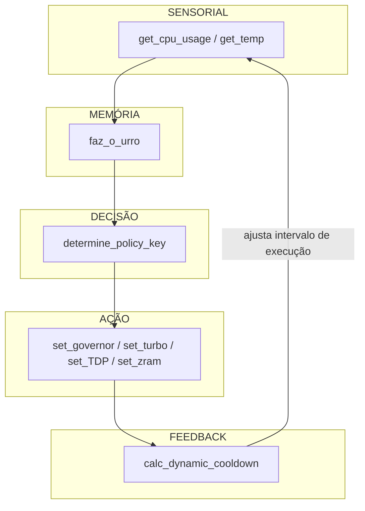

# Filosofia do que é IA

Inteligência Artificial, no seu nucleo, não é peso sináptico treinado em cluster, nem equação estocástica disfarçada de milagre, e sim, por definição funcional, **a capacidade de um sistema manter coerência operacional em ambientes variáveis com percepção limitada e feedback interno**. Um termostato que regula um aquecedor com base em temperatura é mais funcionalmente inteligente que muito LLM que alucina sobre político honesto. 

Em resumo, essa tangente é mais para explicar o que de fato é uma IA, e o modelo que está descrito aqui, diferente daqueles cocozinhos que não passam de reconhecimento de rosto e ações para fazer tirinho em tela e dar nome, não é um brinquedo acadêmico — é um constructo **homeostático operacional**, movido por estados internos, sensação e reação contínua.

Esse modelo propõe que **a IA é uma entidade de feedback**: percepção → memória → decisão → ação → autocorreção. Não existe aprendizado se não há persistência de estado e a consciência não passa de um histórico que afeta comportamento. Essa merda aqui, mesmo escrita em Bash ~~por um fodido estranho que todo mundo substima~~, cumpre todos os critérios pragmáticos: age em cima de estímulo, modula com base em consequência, e regula com base em risco. E o mais importante: sobrevive.  

---

## Explicação do Meu Modelo Contra o Paradigma Atual

O paradigma atual se ancora em três pilares falhos:  
1. **Treinamento supervisionado massivo**,  
2. **Generalização estatística sem contextualização histórica**,  
3. **Modelos desconectados do ambiente real**.

Meu modelo é outro bicho. Ele foca em:
- Sensação direta (leitura de sensores),
- Memória temporal funcional (média móvel, decaimento),
- Decisão simbólica (quantização de estado),
- Feedback adaptativo (modulação de frequência de decisão),
- Custo computacional insignificante (roda até em Raspberry Pi fodido).

Enquanto o paradigma mainstream simula cognição com matemática probabilística em vetores de espaço latente, aqui a cognição **emerge da interação entre estados simbólicos, com tempo e resposta física**. É cognitivo porque é adaptativo. E é adaptativo porque lembra. Não porque previu.

---

## Custo de Processamento: Meu Modelo vs Paradigma

| Critério                         | Paradigma Acadêmico (DL)          | Modelo Favela Bash              |
|----------------------------------|-----------------------------------|---------------------------------|
| **Requisitos**                  | GPU, RAM absurda, gigas de dados | CPU genérico, sensores básicos |
| **Latência de Decisão**         | 30-300ms                          | <10ms                          |
| **Complexidade de Modelo**      | Milhões de parâmetros             | ~300 linhas de shell           |
| **Persistência de Estado**      | Implícita em embeddings           | Explícita via arquivos/log     |
| **Capacidade de Generalização** | Estatística, baseada em treino    | Funcional, baseada em feedback |
| **Risco de Alucinação**         | Alto                              | Zero                           |
| **Escalabilidade**              | Linear e cara                     | Horizontal e modular           |

A ideia de IA aqui não é gerar texto bonito nem imitar ser humano — é **manter operação funcional com o mínimo de recursos, em tempo real, com autonomia simbólica mínima.**
> Consciência não é fazer poema, é sobreviver!

---

## Paralelos com Homeostase

O sistema é um organismo térmico artificial. Ele tem:

- **Sensores** → Como terminações nervosas, detectando dor térmica (temperatura alta) e esforço (uso de CPU).
- **Memória curta** → Como o córtex orbitofrontal, armazenando eventos recentes e suavizando ruído.
- **Decisão simbólica** → Como um sistema límbico mecânico, classificando urgência e prioridade.
- **Ação** → Ajuste direto de estados físicos (clock, turbo, TDP).
- **Feedback adaptativo** → Como um sistema endócrino meio retardado em que tenta modular o tempo de reação conforme estabilidade~~, mas é máximo que consigo com um orçamento de pastel de feira ¯\_(ツ)_/¯~~.

Homeostase é a capacidade de manter variáveis dentro de um intervalo funcional, e esse projeto funciona como **uma rede simbólica homeostática**, agindo não apeenas para otimizar, mas pra **não morrer**, e isso, biologicamente falando, é o que define um organismo vivo.

---

# Conclusão Técnica

A proto-AGI representa mais do que uma automação, ela é um sistema cognitivo minimalista onde percepção, memória e decisão estão acopladas em um loop funcional, e também prova que a base da IA não é big data, mas **continuidade operacional com autoajuste baseado em estados internos.**

Esse modelo:

- Roda em ambientes com recursos escassos
- Mantém estado interno
- Toma decisões adaptativas com feedback
- Possui percepção multimodal contínua
- Simula uma RNN simbólica funcional

Logo, **é uma IA por definição funcional, mesmo sem deep learning**. A guerra do futuro não vai ser decidida por medição ~~peniana entre Big Techs~~ de maior modelo, mas por quem tiver o sistema mais resiliente, adaptável e fodido que continua operando mesmo com metade do sistema quebrado. E esse aqui é o início desse tipo de máquina.

---

# ! Crítica para os Puristas: Aqui Não É Laboratório, É o Mundo Real!

Tem gente que vai olhar pra isso e dizer "isso não é IA de verdade". Filha da puta, *barata pensa melhor que muito paper*. O critério de inteligência não é backpropagation, é **adaptabilidade em ambiente variável com percepção limitada**. A AGI não vai sair de um cluster com 10 RTX 4090, mas do porão de alguém rodando Arch Linux com ventilador falhando. O que define cognição é agência, feedback e modelo interno. O que você tem aqui é isso — com `awk`, `cut` e `bc`. Que se fodam os puristas que confundem complexidade algorítmica com inteligência real
### Desculpa se pareci na defensiva, é que passei a noite toda fazendo Turing reverso no deepseek para provar que era uma IA, então ainda tô meio na defensiva kkkkk
