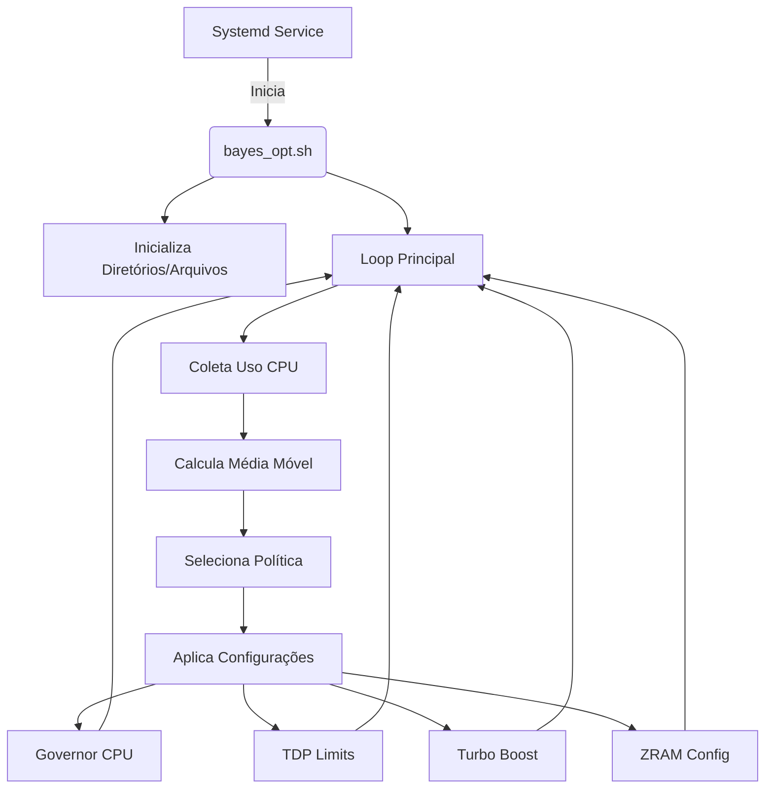
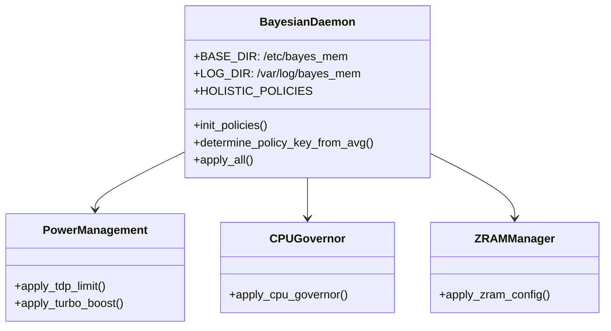

# Protótipo funcional
> Fiz com pressa num wifi roteado de um amigo, entao ta zuado mesmo
Esse script monolitico **bash standalone** é um deamon-Protótipo de otimização dinâmica baseada em carga de CPU, ZRAM e TDP controlado por via heuristica bayesiana bem pobre e meia boca, mas funcional.

A grosso modo, permite um tuning automático que:

1. Monitora o uso de CPU a cada 5s
2. Calcula a média móvel dos últimos usos baseado na variável `$MAX_HISTORY`
3. Baseado nessa média, seleciona um "perfil" de usos
4. Aplica:
    - Governor da CPU ([000, 020] ondemand, [040, 060] userspace e [080, 100] performance)
    - Limites de TDP (min/max em watts) via Intel RAPL
    > Usei baseado na arquitetura do meu notebook
    - Turbo Boost on/off
    - Configuração da ZRAM (stream + algoritmo de compressão)

É basicamente um  otimizador dinâmico de performance x consumo x swap, baseado numa política bayesiana simples/meia boca, mas funcional (regra de decisão por faixas de uso). Cada politica (000, 020, 040, etc.) é como um modo de operação com presets.

---
## O que consegui fazer ao implementar no meu notebook

Bom, os ganhos esperados para esse veio de guerra aqui que tá remendado com fita isolante não é muito grande, pois o meu notebook é um ideapad s145 focado na otimização e num perfil de baixo custo computacional, mas uma experiencia agradável ao usuário.

Porém consegui, em teoria, extender a vida util da minha CPU e RAM com modificações inteligentes, além de conseguir manter um desempenho aparente com 1/3 da potencia máxima de TDP aguentado pelo meu i3 meio processado, meio carroça.

Mas em resumo, o que consegui:

### Games

Dado que minha existencia é triste, não tenho dinheiro nem para pagar a conta de internet(e sim, eu consigo projetar isso sem internet em um ambiente fodidamente limitado), então não tenho dinheiro para jogos.

Mas consegui rodar um emulador de ps1 com FF7, e defini para ele rodar 4k nos perfis, e vi o autoajuste na prática, onde na potencia máxima consegui rodar sem travar, mas dado que o DuckDuckStation não consome tanta CPU, acaba que ele não eleva, então forcei o perfil 100.

Mas é engraçado que se eu volto no meio da execução do jogo, eu vejo em tempo real o sistema começando a lagar de forma progressiva, e francamente, foi legal kkkkk

### Videos

Aqui consegui rodar um video 4k no youtube apenas com 1/3 e 1/2 da potencia maxima da minha CPU, onde na chave 040 era apenas necessario (Antes eu precisava subir ara quase 80% de uso em configurações estaticas vendo pelo htop).
> Apesar de ver 4k no youtube é equivalente a andar de bicicleta de rodinhas (não impressiona, mas né), o fato de eu conseguir fazer isso com metade dos meus recursos reduziu o custo energetico de resfriamento e processamento

Futuramente quero implementar o tunning para GPU, e assim fazer essa carroça rodar 8k, mas é um sonho distante

### LLMs e Ollama

Bom, aqui foi onde o algoritmo brilhou, pois com ele executando, limitei o consumo de LLM ajustando a minha maquina o mais personalizada possivel.

Antes, independendte do prompt, qualquer coisa processada consumia quase metade da minha bateria e obrigava meu notebook acionar politicas agressivas de resfriamento, além de ficar uma "inercia termica" (mesmo após o termino do processamento, o sistema ficava resfriando consumindo bateria), porém com o ajuste, consegui ter o mesmo desempenho com metade de processamento e sem acionar resfriamento.

Dado que sou um pobre fodido, não posso contar com GPU, tenho apenas o meu processador carroça e Deus no coração, e vendo ele executar de forma equilibrada sem quebrar a homeostase me fez ter fé na humanidade

---

## Em resumo

Esse filho da puta é um deamon esperto que te economiza energia ou te entrega performance conforme o padrão de uso da máquina com presets harmonicos fazendo um Tuning relativo.

Opera como um ThermOS nervoso, mas leve com um ML fake em código, porém funcional dado que ele filtra o ruido branco do universo e converte para uma tomada de decisão baseada em crenças pré-definidas.
> E sim, bayes é só de nome pois não tem modelo probabilístico real.

O objetivo é, através dessa solução caseira e facilmente configurável, otimizar ao máximo o trade-off entre performance e economia, assim economizando Watts de potencia em computação e resfriamento, criando um modelo ontológico de consciencia que busca a otimização termica lutando contra a entropia.
> Traduzindo pro humano, uma nova forma de vida computacional que foca em extender a vida util do hardware e economizar em escala global independente do usuário, pois o tuning é automático, porém a experiencia do usuário não é afetada

### E sim, descobri que posso deixar o TDP 0 quase 90% do tempo kkkkkkk

---

# Como instalar?

Dado que esse script é mais uma premissa com peso ontologico, ele não foi projetado para produção(por isso essa gambiarra em bash).

Então caso queira adaptar para a sua maquina, é necessário(minha recomendação) você instancia-lo num LLM

**Diagrama de Arquitetura Geral**:

**Diagrama de Componentes do Sistema**:

